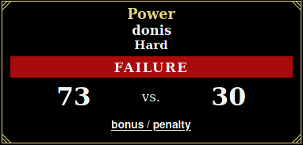

# Roll20 Stats viewer

A small interface to show rolled dices on Roll20. This is a very early version. 

## Testing it live

A demo with fixtures is hosted on [GitHub pages](https://sotrxii.github.io/roll20-stats-viewer/).

An actual live version, allowing you to get your info on your games, is running here.
**However, please be aware that the recommended way to run this project is to run your own instance.**
There is no Roll20 OAuth mechanism whatsoever, your credentials are used to connect to your account
and collect the data needed (see [backend](https://github.com/SoTrxII/roll20-stats-viewer-backend)).
If you're using this live version, connect to it using a throwaway/bot account, or change your
account password after using it.

## Features

- Aggregate general info on campaigns, such as time played or dice rolled count
- Display dice result chart for each individual session of for the whole campaign
- View each individual game session (more on that in [assumptions on the backend page](https://github.com/SoTrxII/roll20-stats-viewer-backend))

### Modes

Using env variables, it's possible to configure this project to work in two different ways.

#### Dynamic mode

This is the "multi-users" mode. Each user navigating to the frontend will be asked to enter his credentials.
These credentials will be transmitted to the backend, allowing it to retrieve the data associated with them.

#### Static mode

This mode using a single Roll20 account, specified in the backend with env variables. All users navigating to the
frontend will be able to see the retrieved data without login in.

This is the "bot account" strategy, and actually the way I'm using it.

### Roll parsing

There are two ways Roll20 to roll dice in Roll20 :
+ Using the dedicated command (/r <#dices>d<#faces>)
+ Using a templated roll (macros with html output, ex Cthulhu roll)


Currently, the following templated rolls are supported:
+ Cthulhu 7e
  


All others templates will be ignored when parsing. You can view how to contribute another template in the 
[contributing](#contributing) section.

## Building your own instance

### Configuration
Create a `.env.production` file and fill it with these values :
```dosini
# Your backend instance URL, hosted somewhere
VUE_APP_BACKEND_URL=<your-backend-instance-url>
# See modes. Backend must be configured accordingly.
VUE_APP_AUTH=<DYNAMIC||STATIC>
```


### Docker
In Vue, env variables are evaluated at build time. You must complete the [configuration](#configuration) part before
building the project. Also, the [backend](https://github.com/SoTrxII/roll20-stats-viewer-backend) must be running.
```sh
# In the project directory
docker build -t stats-viewer .
# Running it on port 3000
docker run -p 3000:80 -it stats-viewer
```

## Contributing

All contributions are welcome. 

### Roll parsers

Adding a new roll template parser is fairly simple:
+ Create a new class in `src/services/parsers` implementing the IRollParser interface
  
```ts
// File: src/@types/roll-parsing.service.d.ts
// ChatMessage and IParsedRoll defintions are in the same file.
 export interface IRollParser {
    /**
     * Name of the template, "callofcthulu", "dnd"...
     * The parser can be used for multiple templates
     */
    templateName: string[];
    parse(message: ChatMessage): IParsedRoll | undefined;
}
```
+ Register the new parser in the DI container.
```js
// File: src/inversify.config.ts
// Example registering "NewRollsParser"
// Old dice parsers
container.bind<IRollParser>(TYPES.RollParser).to(PlainRollsParser);
container.bind<IRollParser>(TYPES.RollParser).to(CthuluRollsParser);
// Register the new dice parser
container.bind<IRollParser>(TYPES.RollParser).to(NewRollsParser);
```
+ The new roll parser wil be picked up by the RollParsingService.
